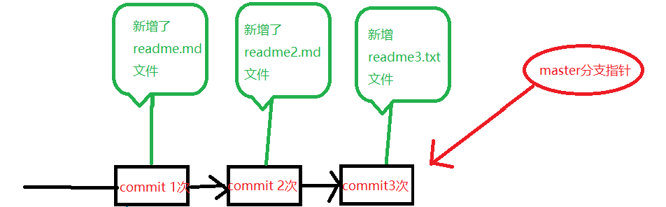
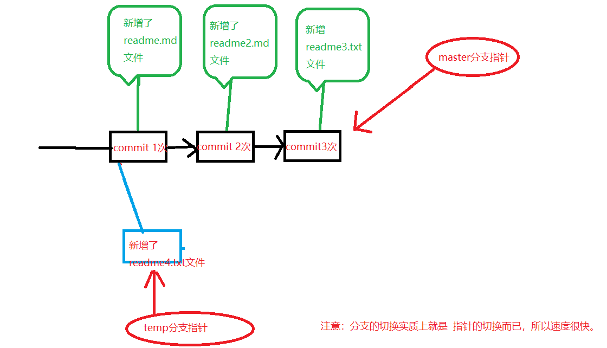

## Git分支常用指令[分支的新建与合并官网](https://git-scm.com/book/zh/v1/Git-%E5%88%86%E6%94%AF-%E5%88%86%E6%94%AF%E7%9A%84%E6%96%B0%E5%BB%BA%E4%B8%8E%E5%90%88%E5%B9%B6)

+ 创建并切换分支
  + `$ git checkout -b temp `
+ 查看分支情况
  + `$ git branch -v`
+ 切换分支
  + `$ git checkout master`

+ 删除分支
  - `$ git checkout -d temp`
+ 合并分支
  - `$ git merge temp`,这是切到master分支上进行的操作，然后合并temp、

## Git分支合作简介

- 这里对分支的内容很详细，下图只是我工作常用的总结：[分支的新建与合并官网](https://git-scm.com/book/zh/v1/Git-%E5%88%86%E6%94%AF-%E5%88%86%E6%94%AF%E7%9A%84%E6%96%B0%E5%BB%BA%E4%B8%8E%E5%90%88%E5%B9%B6)

+ 第一种情况：

  

  - 如上图，我很愉快的在master分支上已经进行了几次版本的更新，现在是最新的版本3。

  ​

  *************

  

  - 接着，我在**版本1 的基础上创建了temp分支**，如图我创建了 readme4.txt文件，而且将其commit，切换到master分支进行分支的合并操作`$ git merge temp`，这样并不会冲突，因为没有涉及到同一个文件的更改。
  - but，如果我在temp分支上进行的操作是：修改了readme.md文件，那么我合并的时候，就会出现冲突，因为我版本2和版本3 发现现在的自己保存的readme.txt文件和现在要合并的这玩意发生了**不一致性**，所以我们就要手动解决一下冲突~~

+ 第二种情况：

  + 在master分支上新建了 hello.txt 文件并提交
  + 这个时候需要完成另一个功能 doSomeThing,然后切出一个do分支，进行功能的完成，新建了dosomething.txt文件。
  + 然后发现主线上有bug, hello文件里有错误，然后切换到master上进行修改，完毕提交之后，切回来继续完成dosomething
  + 分支功能完成，切换到master进行合并。
  + 发现hello文件主线和分线不一致，出现冲突，进行解决。解决完add commit。

+ 第三种情况：跟第二种基本一样，只不过修复bug的时候，在master切出去进行修改的

  + 在master分支上新建了 hello.txt 文件并提交
  + 这个时候需要完成另一个功能 doSomeThing,然后切出一个do分支，进行功能的完成，新建了dosomething.txt文件。
  + 然后发现主线上有bug, hello文件里有错误，切出 fixbug 分支进行修改，完毕合并到master
  + do 分支功能完成，切换到master进行合并。
  + 发现hello.txt文件不一致，手动解决冲突