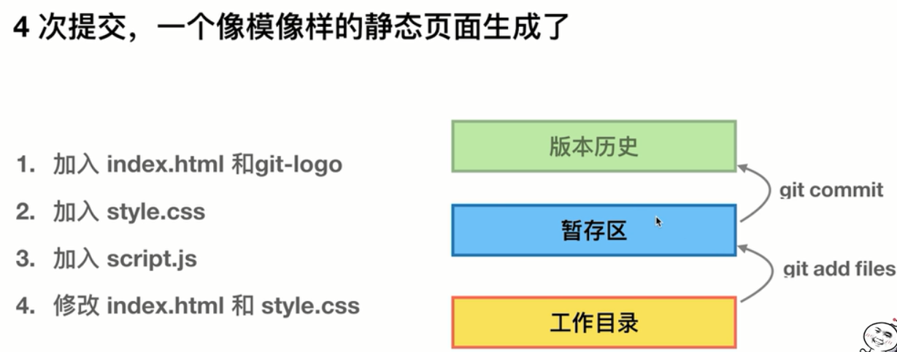

# Git 常用操作命令

##[Git 官网地址](https://git-scm.com/book/zh/v1/%E8%B5%B7%E6%AD%A5-Git-%E7%AE%80%E5%8F%B2)

## 使用之前需要做的

- **配置user.name和user.email**
  - `$ git config --global user.name 'yourname'`
  - `$ git config --global user.email 'yourEmail'`
- **config的三个作用域**
  - `git config --local` ，***local*** 只对某个仓库有效，必须在已经初始化的某个仓库里面进行命令的执行，**优先级最高**
  - `git config --global`，***global*** 对当前用户的所有仓库都有效
  - `git config --system`，***system*** 对当前系统的所有用户有效，一般不用
- **查看配置 **
  + `$ git config --list local` , 需要注意的是，查看local也需要在已经初始化的某个仓库里查看
  + `$ git config --list global`
  + `$ git config --list system`

## 建Git仓库

**1. 把已经有的项目放入git管理 **

- `$ cd 指定文件夹` 		`$ git init`

**2.新建的项目直接使用git管理 **

- `$ cd 某个文件夹`		`$ git init your_project_name` Git会在该目录下建一个同名的文件夹
- 然后就可以进入你的该项目了 

###小测试

​	现在我新建一个README.md文件，然后    `$ git commit -m 'add readme'`，那么 Git会报错 _untracked files_

原来是因为每次commit之前，我们必须先将文件增加到Git的管控当中 `$ git add README` , 然后才能commit ！

##向仓库中添加文件

***思考暂存区的作用：***

​	暂存区，顾名思义暂时存储，就是文件现在已经给git管理了，但是还没正式提交，你可以回退

###添加操作

- **手动添加了index.html文件，和 images/git-logo的图片**
  - `$ git status  `查看当前状态，发现新增的两个文件 untracked files
  - `$ git add index.html images` 将2个文件纳入Git管理
  - `$ git commit -m 'add index and images'`正式提交
- **再新增 styles/style.css 文件**
  - `$ git add styles` 	`$ git commit -m 'add styles'`
- **再新增 script/script.js文件**
  - `$ git add script` 	`$ git commit -m 'add script'`
- **查看log记录**
  + `$ git log ` 				可以发现4次commit的记录，以及每次记录的 简要
- **修改index.html文件**
  - `vi index.html`			增加一行文字 "参考自极客时间"
- **再一次查看Log**
  - `$ git log `				发现信息 	***modified ：	index.html***
- **现在我们需要将修改之后的提交**
  - `$ git add -u`			-u 表示被Git管理的 全部文件
  - `$ git commit -m 'modified index.html by adding 参考极客时间'`

_注意：对于添加操作，我们工作比如在工作目录里面新增或者修改了5个文件，这5个文件是一体的，一个集合，那我们应该将其一起add 一起commit_

## 给文件重命名

###我们先进行传统的mv操作，也就是Linux的mv操作命令进行文件重命名

- 分三步

  1.  `$ mv README.md readme.md` ,这个时候git status会是     一个 untracked files: readme.md ;

  另一个是deleted：README.md，因此我们需要将这两个变动都进行暂存区的对应操作。

  2. `$ git add readme.md`
  3. `$ git rm README.md`  这个时候的git status就会是绿色 ：renamed : README.md  -> readme.md

- 现在我们用 git 的重命名方式来进行 **合三为一**

  * 需要注意的是，这个时候我上面的操作并没有_commit_，所以我可以将我暂存区的现有内容清除，哈哈，这个动作比较危险的，那么我暂存区现在就剩 rename 这个东西了，因为之前的都已经提交了嘛。清除的命令就是`$ git reset --hard`
  * `$ git mv README.md readme.md`
  * 然后提交 **commit**

##Git log 查看版本历史

- 让log更整洁一点吧
  - `$ git log --oneline`
- 我只看最近的几个log
  - `$ git log -n2 --oneline`
- 为了演示 git log  效果，让我们先来整一个分支吧
  + `$ git branch -v`	发现目前只有一个 master 分支
  + `$ git checkout -b temp XXXXXXXXXX`   这个叫 **创建并切换 **分支，**并且是基于XXX版本的**
- ​